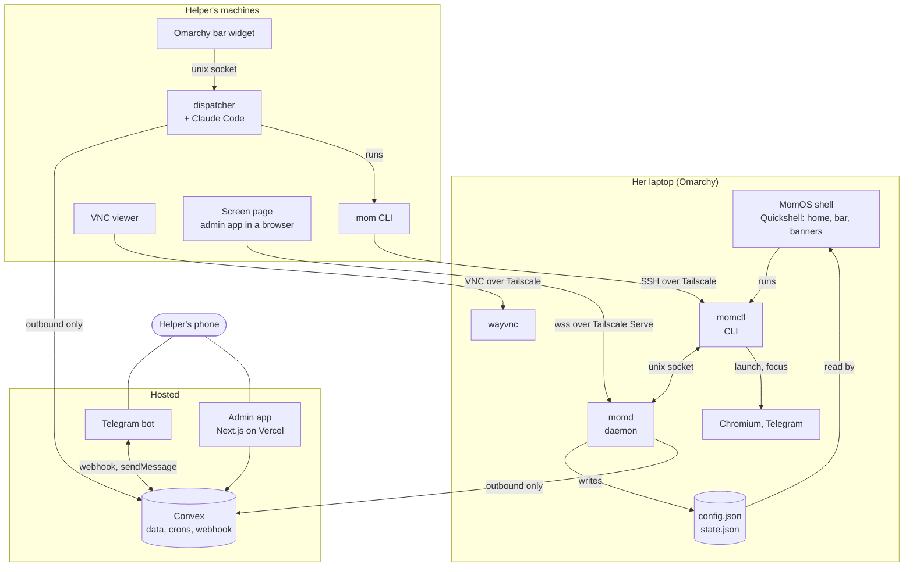

# Architecture

MomOS has parts on three kinds of machine: her laptop, the helper's machines, and hosted services. This page shows how they connect. [contracts.md](contracts.md) is the precise reference for every file, command and function between them, and when code and contracts disagree, one of them gets fixed in the same change.

## The picture

Arrows show who starts the connection. Nothing on the internet starts a connection to the laptop or to the helper's home. The laptop starts outbound connections to Convex only. The helper's devices reach the laptop over Tailscale, and the laptop can't reach them. That includes the admin app's Screen page: the page comes from Vercel, but the browser then connects to the laptop over the tailnet, so it only works on a device with Tailscale on.

## The parts

**On her laptop:**

- **The shell**, in `shell/`, is her whole screen: home tiles, the bar, the Family page, banners, message cards (it's her notification server), reminders, the lock screen and the screensaver. It's QML for Quickshell, run as `qs -c momos`. It reads `~/.config/momos/config.json` and `$XDG_RUNTIME_DIR/momos/state.json`, keeps her chosen colors, text size and icons in `~/.config/momos/appearance.json`, and calls `momctl` to act. It works with momd down.
- **momd**, in `apps/momd/`, is a user service. It watches the network, battery, focused window, lid, lock and screen viewers; keeps one window on screen and sends her home when the one she was using closes; writes `state.json` every 10 seconds and on every change; queues events in SQLite and uploads them to Convex; applies settings, reminders and photos from Convex; carries out the allowed actions; sends help requests, through an outbox that waits out the internet, and records voice notes; follows Telegram's unread count for the badge on its tile; keeps the screenshot ring buffer; reconnects her saved Bluetooth speaker after login and after sleep; and, only while the helper has started screen sharing from the admin app, runs a second wayvnc and passes browsers to it ([contracts.md](contracts.md#screen-sharing-in-a-browser)). It serves a JSON-lines socket for `momctl`.
- **momctl**, in `apps/momctl/`, is the command-line tool that does everything on her screen, printing JSON. Most commands work without momd.
- **system/** holds `install.sh` and the files it installs: her Hyprland config, systemd user units, the Chromium policy, udev and polkit rules, PAM for the lock screen.

**On the helper's machines:**

- **mom**, in `apps/mom/`, wraps SSH over Tailscale, with one persistent connection per laptop, and runs `momctl` as her. It also deploys, updates, opens VNC and creates devices.
- **The dispatcher**, in `apps/dispatcher/`, subscribes to agent jobs in Convex, runs Claude Code headless with an allowlist of `mom` commands, and writes reports back. It also serves a local socket for the bar widget.
- **The bar widget**, in `helper/omarchy-plugin/`, is an Omarchy shell plugin that draws what the dispatcher tells it.

**Hosted:**

- **Convex**, with its code in `packages/backend/`, holds every table, runs crons for cleanup, lease expiry and weekly reports, and serves the Telegram webhook. It has three kinds of caller, each with its own auth: devices by token, the admin app by Clerk plus an email allowlist, and the dispatcher by a shared token.
- **The admin app**, in `apps/admin/`, is Next.js on Vercel, signed in with Clerk.
- **The Telegram bot** is a bot token and a webhook pointing at Convex. It has no server of its own.

**Shared:** `packages/shared/` holds the zod schemas every part checks against: settings, tiles, actions, events, state and reminders.

## Following a help request

1. She presses **Help** on the bar. A card opens over whatever she's doing. She types "The video stopped" and presses **Send to Sam**. The shell runs `momctl help --text "The video stopped"`.
2. momctl asks momd over its socket. momd puts the request in its outbox, in SQLite, then sends it: it calls `device.createHelpRequest` with her words and her current status. For **Show Sam my screen**, the shell hides the card first and momd takes the picture with `grim` before anything else. For **Say it out loud**, momd recorded with `pw-record` and encoded Ogg Opus with `ffmpeg`, and uploads the note.
3. Convex stores it and schedules the Telegram message: a headline, her words, the context, then the picture or voice note, with buttons. No agent starts: she often uses Help just to talk to the helper. The card says "Sam has your message."
4. The helper taps **Got it**. Her screen says "Sam saw your message." The helper replies "I'll call you in five minutes." Telegram posts it to the webhook. Convex checks the secret and sender, maps the reply to the help request, and queues a `say` action.
5. momd, subscribed to its pending actions, gets it within a second, checks it against the action schema, writes the banner to `state.json`, and marks the action done.
6. The shell sees `state.json` change and shows "Sam says: I'll call you in five minutes."
7. If it looks like a problem with the laptop, the helper taps **Send an agent**, adds a note or taps Send without a note, and the agent's report arrives as a reply to her help message, with Approve fix, Investigate more, Dismiss, and Send this to Mom when it suggests a message for her.

If the internet is down at step 2, the request waits in momd's outbox and goes by itself when the internet is back. The card says so and shows the helper's phone number.

The ring buffer of screenshots, one a minute for ten minutes, stays on the laptop. Only the helper's **Last 10 minutes** button sends it, and she sees "Sam is looking at your last few minutes" first.

## Following an agent job

1. The helper tapped **Send an agent** under her help message, with or without a note, so Convex created a job with status `queued`. (Or the helper replied "look", started one in the admin app or the bar widget, or sent `/run`. With `helper.autoInvestigate` on in her settings, her written or spoken request starts one by itself.)
2. The dispatcher, subscribed to `dispatcher.pendingJobs`, claims it with a 5-minute lease and starts `claude -p` with the investigate prompt and read-only `mom` commands.
3. The agent runs `mom status`, `mom screenshot` and `mom logs`, which SSH to the laptop and run `momctl`. It writes a report.
4. The dispatcher sets the job to `awaiting_approval` with the report. Convex sends it to Telegram.
5. The helper taps **Approve fix** or replies "go". The job becomes `approved`. The dispatcher resumes the same Claude session with the fix commands, and reports again when done.

## Degrading

Each part keeps working when the ones it depends on are gone. The table in [contracts.md](contracts.md#rule-one-every-part-degrades-on-its-own) is the rule every change is checked against.
