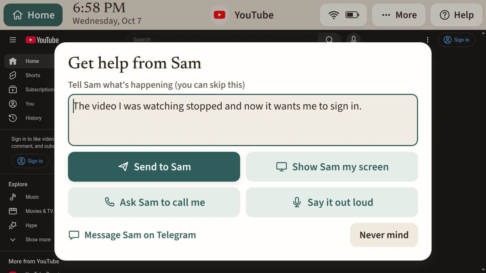
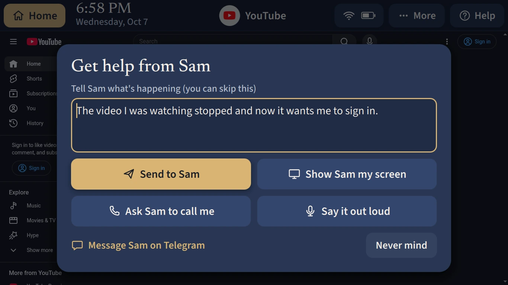
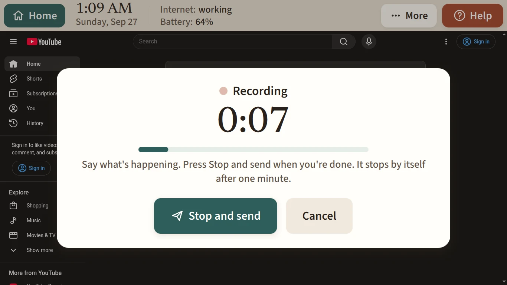
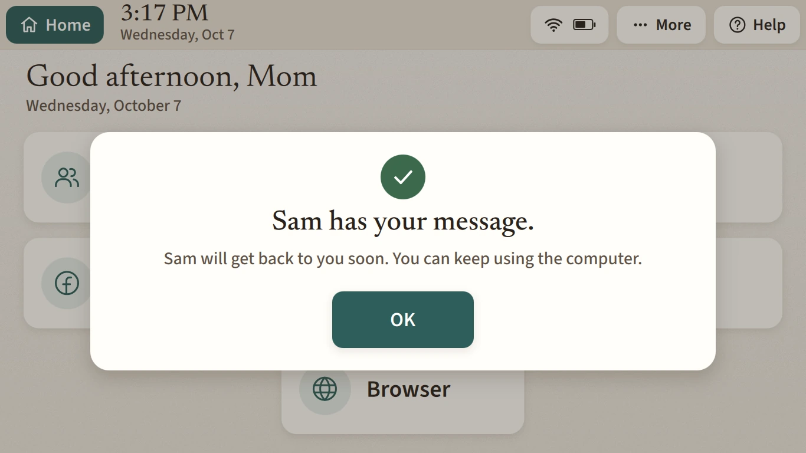
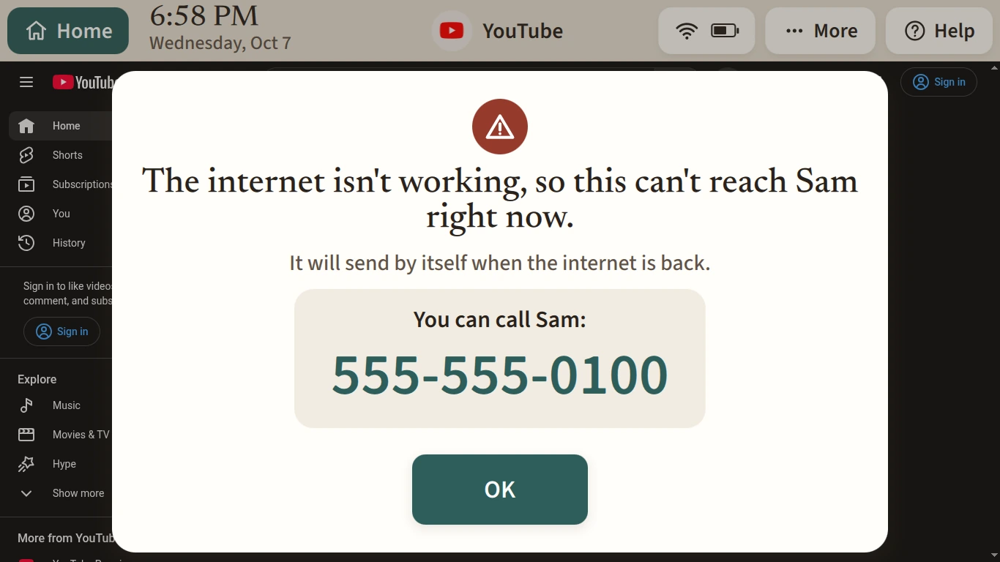

# When she asks for help

This is what she sees when she presses Help, and what reaches you.

## Her side

The bar's Help button opens a card in the middle of her screen. Whatever she was doing stays there around it under a soft shade, so what she's asking about is still in front of her.



The card says "Get help from Sam" and has a box for her words: "Tell Sam what's happening (you can skip this)". Under it are four ways to ask:

- **Send to Sam** sends what she typed. It stays greyed out until she types something.
- **Show Sam my screen** takes a picture of the screen behind the card and sends it, with her words if she typed any. The card gets out of the way first, so the picture is of her app, not of the card.
- **Ask Sam to call me** asks you to phone her.
- **Say it out loud** records a voice note. A big timer counts up to one minute, with **Stop and send** and **Cancel**. At one minute it stops and sends by itself.

**Message Sam on Telegram** opens her Telegram chat with you, if your username is in Settings. **Never mind**, Esc, or a click on the shade closes the card and sends nothing. What she typed is kept for next time.





After she sends, the card says **Sam has your message.** and one line about what comes next: "Sam will get back to you soon. You can keep using the computer.", or "Sam will call you soon." after Ask Sam to call me, or "Sam can see what was on your screen." after Show Sam my screen. It never mentions agents. It closes after 20 seconds or when she presses OK. When you press Got it, her screen says **Sam saw your message.**



Without the internet the request waits on the laptop and goes by itself when the internet is back. The card says so and shows your number. When it does go, her screen says "Sam has your message now." If the laptop's own service is down, the card shows your number and keeps what she typed.



## Your side

The request reaches you on [Telegram](telegram.md#a-help-request) with buttons: Send an agent, Message Mom's screen, Screenshot, Last 10 minutes, Reload a page, Watch Mom's screen, Call Mom, Got it, Restart Mom's laptop and Done. It's also in the admin app's [Help inbox](admin-app.md#help).

No agent starts by itself. She often uses Help like a chat, to ask you something that has nothing to do with the laptop, so you decide. Tap **Send an agent** when it looks like a problem with the computer. The bot asks if you want to tell the agent anything: reply with a note, or tap Send without a note. The agent's report comes back as a reply to her message, with Approve fix, Investigate more, Send this to Mom and Dismiss. It only looks. Nothing on her laptop changes until you approve. To go back to an agent on every written or spoken request, turn on "Send an agent on every help request" in the admin app's Settings.

The laptop keeps a picture of her screen every minute for the last ten minutes. Those stay on the laptop. Press Last 10 minutes to see them; her screen tells her first.

## Testing it

`mom press-help` sends a request as the pop-up does, and it really messages you:

```sh
mom press-help --text "TEST: checking help"          # her words
mom press-help --screenshot                           # a picture of her screen
mom press-help --call-me                              # ask for a call
mom press-help --voice-file /tmp/tone.ogg             # an Ogg Opus file on her laptop
```

For a real recording, `mom ssh` to the laptop and, as her, run `momctl voice start`, wait, then `momctl help --voice`.
