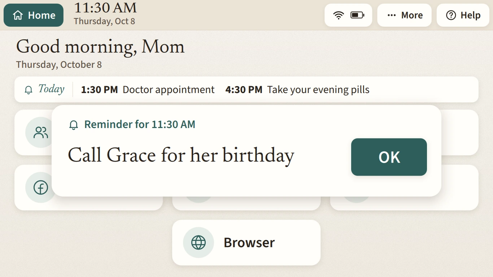
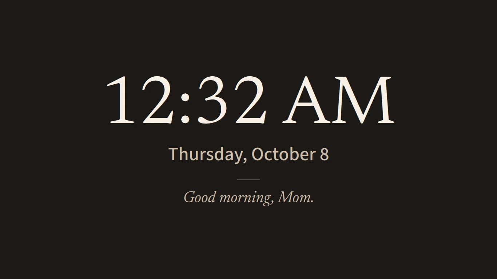
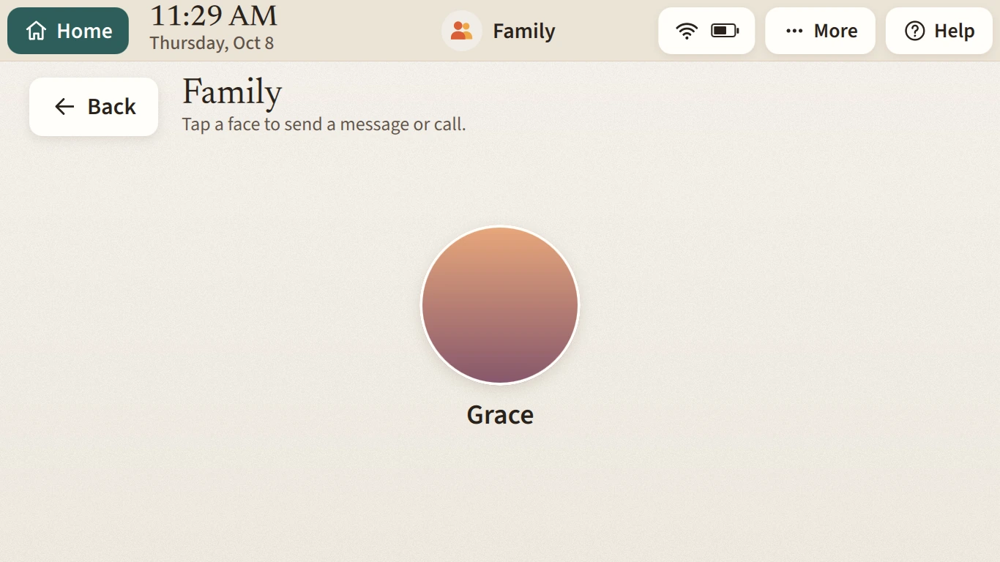

# Reminders and photos

Both live in the admin app and download to the laptop, so they keep working when the internet doesn't.

## Reminders

A reminder has:

- **What the reminder says**, up to 80 characters. Write it the way you'd say it to her: "Call Grace for her birthday", "Doctor appointment at 3".
- **Time**, on the laptop's clock.
- **Repeat**: once on a date, every day, or every week on the days you pick.
- **Show on the home screen**: how long before the time it appears in the reminders line under her greeting, or all day.

At most 50 per laptop.

What she sees:

- **Before it's due**, it's listed in a one-line card under the greeting with its time, from the lead time you chose until it's due.
- **When it's due**, a large card in the middle of her screen shows the reminder and an OK button. It stays until she presses OK, for up to 3 hours. If several are due, she sees the oldest first.

The timeline records when each reminder came up and when she pressed OK, and the weekly report counts them.

momd keeps a copy in `~/.config/momos/reminders.json` and schedules them itself, in the laptop's time zone. So reminders come up on time with the internet down. If momd itself is down, she sees no reminders.

## Screensaver photos

After 3 minutes untouched, her screen shows a slideshow of photos you choose, one at a time with a slow crossfade and a big clock and the date in a corner. Without photos, it shows the clock alone. Any touch of the keyboard, trackpad or mouse ends it, and that touch doesn't reach the app underneath, so she can't click something by accident while waking it.

The screensaver doesn't start while the screen is locked or a reminder is waiting, and a new reminder or message ends it. A video or a call playing holds it off.

On the **Photos** page, press **Add photos** and pick several at once: JPEG, PNG, HEIC or WebP. The app shrinks each to 1600 pixels on the long side before uploading. At most 300 photos, 3 MB each after shrinking. The laptop downloads them to `~/.local/share/momos/slideshow/` and removes any you delete.

## Family photos

The faces on her Family page are separate. Upload them per person in **Settings**, under Family. They download to `~/.config/momos/photos/`.

